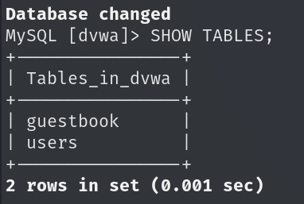

# Lab 2: Cracking Weak Password Hashes & Exploiting Poor Authentication

**Time Allocated:** 3 Hours  
**Total Marks:** 15  

---

## A. Objectives

1. Find and exploit weak crypto in database login and password storage.
2. Do offline cracking of password hashes found in the database.
3. Learn from real-world crypto mistakes and suggest better ways.
4. Write a report in GitHub (Markdown) and show a short demo.

---

## B. Lab Tasks

### 1. Service Enumeration and Initial Access

**Problem Faced:**  
When I tried to connect to the database using:

```
mysql -h 192.168.43.137 -u root
```

It showed this error:

```
ERROR 2026 (HY000): TLS/SSL error: wrong version number
```


This happened because the MySQL client on my Kali machine tried to use SSL by default, but the target machine doesn’t support or is misconfigured for SSL connections.

**How I Fixed It:**  
So I used this command instead:

```
mysql -h 192.168.43.137 -u root --ssl=OFF
```

By adding `--ssl=OFF`, I disabled SSL so the client could connect using plain TCP, which worked. This also shows a security weakness because the database accepts unencrypted connections, which is risky because data (including usernames and passwords) could be sniffed on the network.


---

### 2. User Enumeration and Weak Authentication

After connecting, I used this command to list the databases:
```
SHOW DATABASES;
```


Then I selected the dvwa database:
```
USE dvwa;
```


I listed the tables:
```
SHOW TABLES;
```



I found a users table and ran:
```
SELECT * FROM users;
```

Result:
The query returned several users, and some had extremely weak or reused password hashes. Here's the table content:


**Authentication Flaws Noted:**

- Reuse of weak passwords (admin and smithy both use "password")
 
- Use of MD5, which is deprecated and insecure
 
- Potential use of default credentials

**Is accessing a database with no password a cryptographic failure?**  
Yes. Allowing access to a database without a password bypasses any form of cryptographic authentication. Authentication is a core part of secure systems, and passwords (when properly hashed and stored) are a form of cryptographic defense. No password = no defense.

**How does this violate secure cryptographic authentication principles?**  

- No Authentication Layer: Without a password, there's no cryptographic operation (like hashing, key exchange, or encryption) to verify identity.

- Breaks Confidentiality: Anyone can access sensitive data without needing to break encryption or brute force credentials.

- Violates "Defense in Depth": A secure system has multiple layers of protection (firewalls, credentials, encryption). Skipping passwords removes a critical layer.

### 3. Password Hash Discovery and Hash Identification

I explored the tables in the database and found one that had password hashes. Example hash:
```
0d107d09f5bbe40cade3de5c71e9e9b7
```
Tool Used: `hash-identifier`


> *It identified the hash as an MD5 hash.*

**What cryptographic weaknesses exist in this hashing method?**

The hashes use the MD5 hashing algorithm, which has these weaknesses:
- Fast and Easy to Brute Force: Tools like John or Hashcat can quickly crack it.
- Collision Vulnerability: Two different inputs can generate the same hash.
- No Salt Used: Without a salt, it’s easy to use rainbow tables.
- Outdated: MD5 has been broken for years and is not secure anymore.

### 4. Offline Hash Cracking

I used John the Ripper to crack the password hashes:

Step 1: Save hashes to a file:
```
echo "0d107d09f5bbe40cade3de5c71e9e9b7" > hashes.txt
```

Step 2: Crack it with John the Ripper:
```
john --format=raw-md5 --wordlist=/usr/share/wordlists/rockyou.txt hashes.txt
```
Explanation of Commands:
- `john`: This launches John the Ripper, a powerful password cracking tool.
- `--format=raw-md5`: Tells John that the hashes are plain (unsalted) MD5 hashes. This format must match the type of hash, or John won't crack them correctly.
- `--wordlist=/usr/share/wordlists/rockyou.txt`: Specifies the rockyou.txt wordlist, a popular dictionary of common passwords used in real-world attacks.
- `hashes.txt`: The file that contains the extracted MD5 hashes from the database.

> This command compares each hash in hashes.txt to hashes generated from the words in the rockyou.txt file. If a match is found, the password is considered cracked.

Step 3: Show cracked password:
```
john --show --format=raw-md5 hashes.txt
```
Explanation of Commands:
- This command displays the already cracked passwords.
- John saves cracked passwords to a file called john.pot. If you've cracked them before, this command will show the username:password pairs without cracking them again.


### 5. Cryptographic Analysis and Mitigation


| **Issue**                     | **Description**            | **Mitigation**                                                                 |
|------------------------------ |----------------------------|--------------------------------------------------------------------------------|
| No Password on DB Account     | MySQL allowed root access without password using `--ssl=OFF`                    | Set a strong password for all accounts and disable anonymous login|
| Weak Hash Algorithm (MD5)    | User passwords stored using outdated MD5 hashing                                | Use stronger hashing like bcrypt, scrypt, or Argon2 with salting|
| Easy-to-Crack Passwords      | Cracked passwords like `password` using wordlist (`rockyou.txt`)               | Enforce password complexity and minimum length policy|
| No Encryption in Transit     | Possible plaintext password transmission (check with Wireshark)                | Use SSL/TLS to encrypt communication between client and server|
| Outdated Software (DVWA)     | Metasploitable2 uses old, vulnerable database software                          | Update database software and regularly patch systems|
