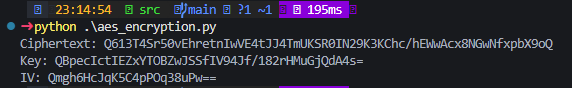

# Lab 4: Implementing Cryptography with Python

## A. Objective:  
In this lab, we will implement fundamental cryptographic algorithms, explore security properties, and understand real-world applications like encryption, hashing, and digital signatures. The tasks are split between symmetric encryption (AES), asymmetric encryption (RSA), hashing (SHA-256), and RSA digital signatures.

## B. Lab Tasks:

### Task 1: Symmetric Encryption (AES)
What is AES?  
AES (Advanced Encryption Standard) is a symmetric encryption algorithm. "Symmetric" means the same key is used to encrypt and decrypt the data. In this task, we’ll be using AES to encrypt a message and then decrypt it back to the original message.

**Steps:**
1. Generate a random key (this key will be used for encryption and decryption).

2. Encrypt a message using the key.

3. Decrypt the message back to its original form.

**aes_encryption.py**
```bash
from Crypto.Cipher import AES
from Crypto.Random import get_random_bytes
import base64

# 1. Generate a 32-byte key for AES-256
key = get_random_bytes(32)  # 32 bytes = 256 bits

# 2. Create a random Initialization Vector (IV) for CBC mode
iv = get_random_bytes(16)  # AES block size is 16 bytes

# 3. Create AES cipher object
cipher = AES.new(key, AES.MODE_CBC, iv)

# 4. Prepare plaintext (must be padded to a multiple of 16 bytes)
plaintext = b"Cryptography Lab by Danish & Raja"
pad_len = 16 - len(plaintext) % 16
padded_plaintext = plaintext + bytes([pad_len] * pad_len)

# 5. Encrypt the plaintext
ciphertext = cipher.encrypt(padded_plaintext)

# 6. Encode ciphertext, IV, and key in base64 to share safely
print("Ciphertext:", base64.b64encode(ciphertext).decode())
print("Key:", base64.b64encode(key).decode())
print("IV:", base64.b64encode(iv).decode())
```

**Output:**  


**aes_decryption.py**
```bash
from Crypto.Cipher import AES
import base64

# 1. Paste your values here (from your encryption output)
key = base64.b64decode("tvPrWH2wVHEtBv4NmHNAoyrTKIdHcVGj5clf2V8TE8g=")
iv = base64.b64decode("PUgXpZIefjVR7BuwzsiSCg==")
ciphertext = base64.b64decode("l/+waUOVxpN0OqS5Mibim5mRmqb1Ez0zwsV2cmeZatOP2eYF2cQxMPG4By7LXBjU")

# 2. Create cipher for decryption
cipher = AES.new(key, AES.MODE_CBC, iv)

# 3. Decrypt ciphertext
padded_plaintext = cipher.decrypt(ciphertext)

# 4. Remove padding
pad_len = padded_plaintext[-1]
plaintext = padded_plaintext[:-pad_len]

print("Decrypted:", plaintext.decode())
```