## Task 1: Generate Your GPG Key Pair

Objective: Use `gpg` to generate an RSA key pair tied to your identity.

**Step 1: Generate RSA Key Pair**
```bash
gpg --full-generate-key
```


When prompted, I entered the following:

Key Type: RSA and RSA (option 1)

Key Size: 4096 bits

Key Expiry: 1y (1 year)

Name: Ahmad Danish Haikal

Email: adanish.abdullah@student.gmi.edu.my

Passphrase: [entered securely]

```bash
┌──(nish㉿NWS23010014)-[~]
└─$ gpg --full-generate-key
gpg (GnuPG) 2.2.46; Copyright (C) 2024 g10 Code GmbH
This is free software: you are free to change and redistribute it.
There is NO WARRANTY, to the extent permitted by law.

gpg: keybox '/home/danish/.gnupg/pubring.kbx' created
Please select what kind of key you want:
   (1) RSA and RSA (default)
   (2) DSA and Elgamal
   (3) DSA (sign only)
   (4) RSA (sign only)
  (14) Existing key from card
Your selection? 1
RSA keys may be between 1024 and 4096 bits long.
What keysize do you want? (3072) 4096
Requested keysize is 4096 bits
Please specify how long the key should be valid.
         0 = key does not expire
      <n>  = key expires in n days
      <n>w = key expires in n weeks
      <n>m = key expires in n months
      <n>y = key expires in n years
Key is valid for? (0) y
invalid value
Key is valid for? (0) 1y
Key expires at Sat 16 May 2026 06:26:53 PM +08
Is this correct? (y/N) y

GnuPG needs to construct a user ID to identify your key.

Real name: Ahmad Danish Haikal
Email address: adanish.abdullah@student.gmi.edu.my
Comment: Practical Test 1
You selected this USER-ID:
    "Ahmad Danish Haikal (Practical Test 1) <adanish.abdullah@student.gmi.edu.my>"

Change (N)ame, (C)omment, (E)mail or (O)kay/(Q)uit? o
We need to generate a lot of random bytes. It is a good idea to perform
some other action (type on the keyboard, move the mouse, utilize the
disks) during the prime generation; this gives the random number
generator a better chance to gain enough entropy.
We need to generate a lot of random bytes. It is a good idea to perform
some other action (type on the keyboard, move the mouse, utilize the
disks) during the prime generation; this gives the random number
generator a better chance to gain enough entropy.
gpg: /home/danish/.gnupg/trustdb.gpg: trustdb created
gpg: directory '/home/danish/.gnupg/openpgp-revocs.d' created
gpg: revocation certificate stored as '/home/danish/.gnupg/openpgp-revocs.d/862235543AA4ECCCDF3ADC20C350E84E8CAFF6CB.rev'
public and secret key created and signed.

pub   rsa4096 2025-05-16 [SC] [expires: 2026-05-16]
      862235543AA4ECCCDF3ADC20C350E84E8CAFF6CB
uid                      Ahmad Danish Haikal (Practical Test 1) <adanish.abdullah@student.gmi.edu.my>
sub   rsa4096 2025-05-16 [E] [expires: 2026-05-16]
```

**Step 2: List the Generated Key**
```bash
gpg --list-keys
```

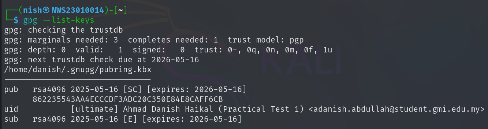

**GPG key pair was successfully generated and linked to my identity.**

## Task 2: Encrypt and Decrypt Files Using GPG

Objective: Use GPG to encrypt and decrypt a file using the public and private key pair you created in Task 1.

**Step 1: Create a Test File**
```bash
echo "This file was encrypted by Nish (NWS23010014)" > message.txt
```

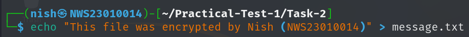

**Step 2: Encrypt the File Using My Public Key**
```bash
gpg --encrypt --recipient "Danish" message.txt
```

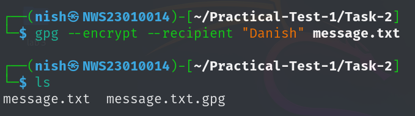

> This creates a new file: message.txt.gpg

**Step 3: Decrypt the File Using My Private Key**
```bash
gpg --output decrypted_message.txt --decrypt message.txt.gpg
```

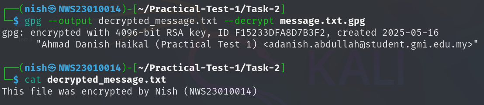

> File Created: decrypted.txt

> Contents: Same as original – “This is a secret message from Nish.”

## Task 3: Sign and Verify a Message with GPG

Objective: Digitally sign a message using your private key, and verify it using your public key.

**Step 1: Create a Plaintext Message**
```bash
echo "I, Nish, declare this is my work." > signed_message.txt
```

**Step 2: Sign the Message**
```bash
gpg --clearsign signed_message.txt
```

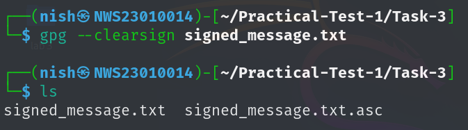


> This will create message.txt.asc – a signed version of my message in ASCII format.

**Step 3: Verify the Signed Message**
```bash
gpg --verify signed_message.txt.asc
```

GPG will check the signature and show something like:
```bash
┌──(nish㉿NWS23010014)-[~/Practical-Test-1/Task-3]
└─$ gpg --verify signed_message.txt.asc
gpg: Signature made Fri 16 May 2025 06:34:18 PM +08
gpg:                using RSA key 862235543AA4ECCCDF3ADC20C350E84E8CAFF6CB
gpg: Good signature from "Ahmad Danish Haikal (Practical Test 1) <adanish.abdullah@student.gmi.edu.my>" [ultimate]
gpg: WARNING: not a detached signature; file 'signed_message.txt' was NOT verified!
```

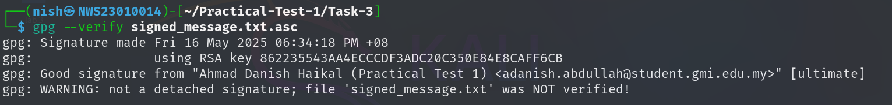

> GPG shows a warning because the signature is embedded (not detached). However, the verification still works, and it confirms that the message was signed by me and hasn’t been altered.

## Task 4: Configure Passwordless SSH Authentication

Objective: Set up SSH key-based login to a test machine (can be localhost or your test VM) and verify you can SSH in without entering a password.

**Step 1: Generate SSH Key Pair**
```bash
ssh-keygen -C "Ahmad Danish Haikal"
```

- When prompted for the file location to save the key, I just pressed Enter to accept the default path (~/.ssh/id_rsa).

- When asked for a passphrase, I left it blank and pressed Enter twice so I wouldn’t need a password when logging in.

```bash
➜ ssh-keygen -C "Ahmad Danish Haikal"
Generating public/private ed25519 key pair.
Enter file in which to save the key (C:\Users\nishd/.ssh/id_ed25519):
Enter passphrase (empty for no passphrase):
Enter same passphrase again:
Your identification has been saved in C:\Users\nishd/.ssh/id_ed25519
Your public key has been saved in C:\Users\nishd/.ssh/id_ed25519.pub
The key fingerprint is:
SHA256:IhdIeiacZNPQIuWmYa2t6K1Y7wDk+JoylOvwOWrjr9c Ahmad Danish Haikal
The key's randomart image is:
+--[ED25519 256]--+
| .*+.            |
|.=o=o.           |
|.+Bo+ .          |
|=+o+   .         |
|+o... o S        |
|.=.  o .         |
|+.= .            |
|*Oo= E           |
|XOO=o            |
+----[SHA256]-----+
```

**Step 2: Copy Public Key to Kali**  
I manually copied the key by:

1. Displaying my public key with:
```bash
cat .\id_ed25519.pub
```

```bash
ssh-ed25519 AAAAC3NzaC1lZDI1NTE5AAAAICvlRgWC+NCbuICR31HSeRjKx0n588CPOELr9gX/ZILQ Ahmad Danish Haikal
```

2. Copying the output and then paste it to Kali Machine into the authorized_keys file in the .ssh directory

```bash
vim authorized_keys
```
3. Then I made sure the permissions on Kali were right:
```bash
chmod 700 ~/.ssh
```

```bash
chmod 600 ~/.ssh/authorized_keys
```

**Step 3: SSH into Kali without Password**  
After copying my public key, I tested the passwordless SSH login by running:
```bash
ssh nish@192.168.43.136
```

> Since the public key was authorized on Kali, I didn’t need to enter a password

To confirm I was on the Kali machine, I ran:
```bash
┌──(nish㉿NWS23010014)-[~]
└─$ whoami
nish
```

**Step 4: Create Your_Name.txt Remotely**  
Once I confirmed the SSH connection worked without a password, I ran this command from my local machine to create a file on the Kali system:

```bash
┌──(nish㉿NWS23010014)-[~]
└─$ echo "NWS23010014" > Ahmad_Danish_Haikal.txt
```
This command remotely created a file called Nish.txt in the home directory of the Kali machine, and it contains my student ID: NWS23010014.

I double-checked the contents by logging in again and using cat:

```bash
┌──(nish㉿NWS23010014)-[~]
└─$ cat Ahmad_Danish_Haikal.txt
NWS23010014
```

> It displayed the correct ID, so the file creation over SSH worked perfectly.

## Task 5: Hash Cracking Challenge

Objective: Crack the provided hashes using various tools, techniques, and wordlists. The goal is to identify the type of hash, apply appropriate cracking or decoding methods, and retrieve the original plaintext.

### Hash 1
```nginx
SnZlcmV4IEF2IEpmcmNyZSBFeiBCcnJl
```
**Step 1: Identify the Encoding**  
I suspected this wasn’t a traditional hash like MD5 or SHA. So, I pasted it into [dCode's Cipher Identifier](https://www.dcode.fr/cipher-identifier) to analyze it.

**Step 2: Recognize It's Base64**
The tool suggested that the string was Base64 encoded. I decoded it using the same site.

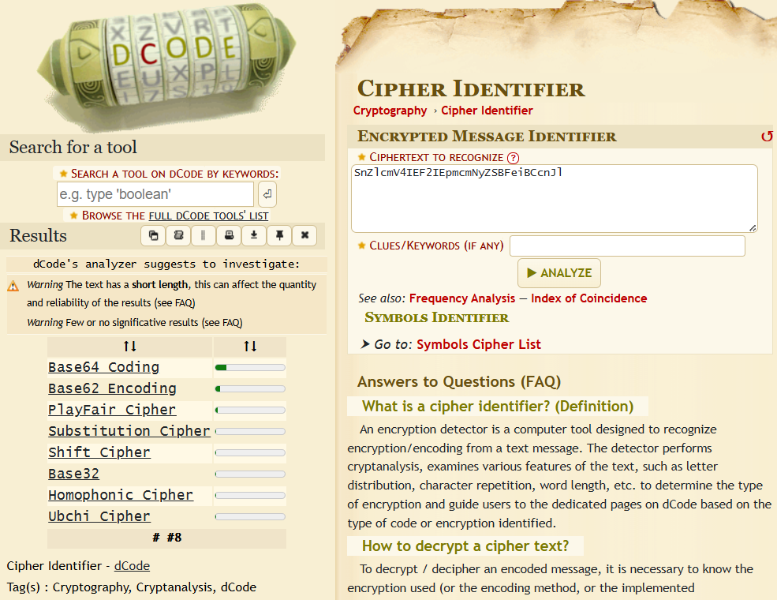

Decoded result:
```bash
Jverex Av Jfrcre Ez Brre
```
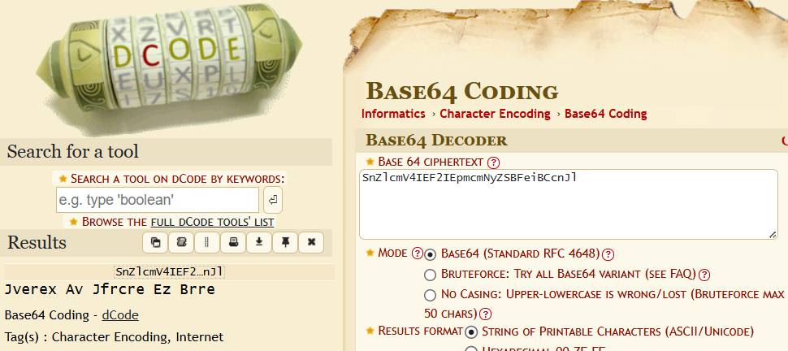

**Step 3: Identify Further Obfuscation**  
That string didn’t make sense at first, so I analyzed it further. dCode suggested it could be a ROT cipher

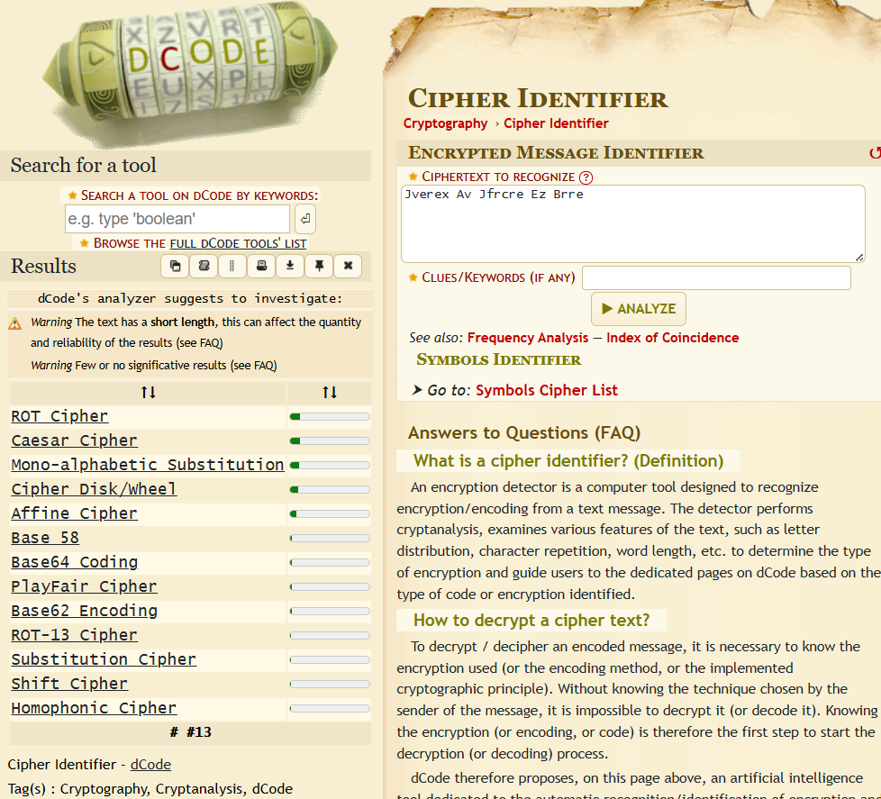

So I clicked on the ROT Cipher tool on dCode and pasted the decoded text there. The tool listed all ROT shifts and found that ROT17 gave a readable sentence:

```bash
Senang Je Soalan Ni Kaan
```

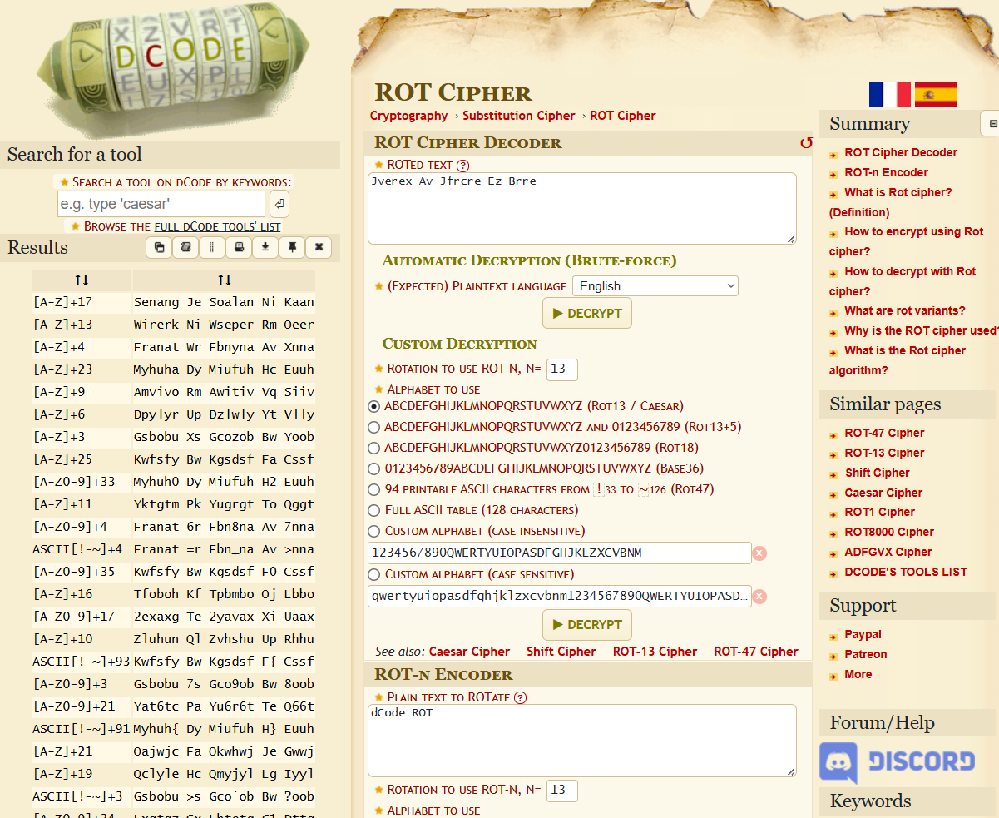

### Hash 2
```bash
7b77ca1e2b3e7228a82ecbc7ca0e6b52
```

**Hash Type:**
- MD5 (-m 0)

**Tools & Commands Used:**
- Tool: Hashcat v6.2.6

- Attack Mode: Dictionary attack (-a 0)

- Wordlist: wordlist.txt (contains Sir Adli motivational phrases)

- Command:
```bash
hashcat -m 0 -a 0 md5.txt wordlist.txt
```

**Cracking Results:**
```bash
7b77ca1e2b3e7228a82ecbc7ca0e6b52:Assalamualaikum Semua
```

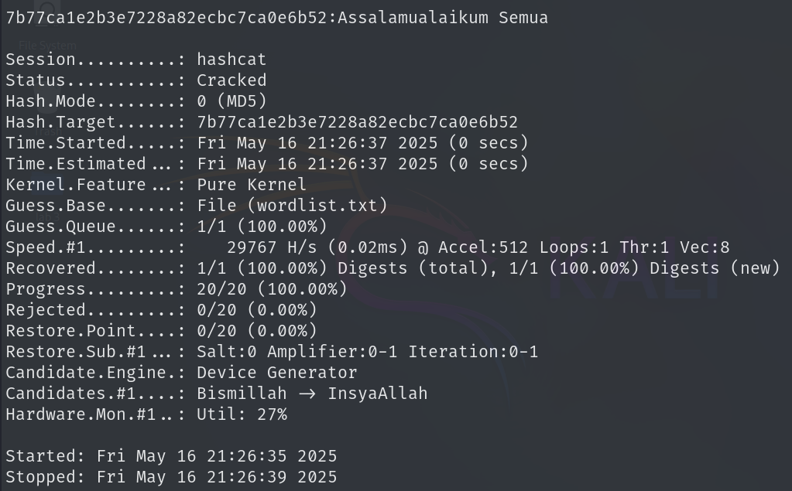

### Hash 3
```nginx
e583cee9ab9d7626c970fd6e9938fcb2d06fbbd12f1c1a3c6902a215808c825c
```

**Hash Type:**
- SHA-256 (-m 1400 in hashcat)

**Tools & Commands Used:**
- Tool: Hashcat v6.2.6

- Attack Mode: Dictionary attack (-a 0)

- Wordlist: wordlist.txt (contains Sir Adli motivational phrases)

- Command:
```bash
hashcat -m 1400 -a 0 sha256.txt wordlist.txt
```

**Cracking Results:**
```bash
e583cee9ab9d7626c970fd6e9938fcb2d06fbbd12f1c1a3c6902a215808c825c:Begitulah Lumrah Kehidupan
```
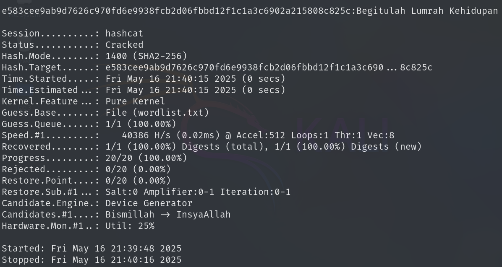

