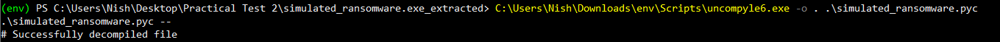

## Simulated Ransomware Analysis and Decryption

In this practical test, I analyzed a simulated ransomware file given by Sir Adli. The goal was to check the file’s integrity, understand how the ransomware encrypts files, find its encryption key, and write a program to decrypt the locked files.

Before doing anything with the simulated ransomware file, you must disable Windows Defender (a.k.a. Windows Security). If you don’t, it will detect the file as a threat and quarantine it immediately which is exactly what happened to me.

Here’s what I did:

- Go to Start > Windows Security > Virus & Threat Protection.

- Click on "Manage Settings" under Virus & Threat Protection Settings.

- Turn off Real-time Protection and other 3 options under Virus & Threat Protection Settings.


> If you're running this in a VM or lab, it’s safe to do this. Don’t turn off Defender on your main machine unless you're 100% sure what you’re doing.

Now that Windows Defender is out of the way, we can finally get to work without it ruining the party.

### Step 1: Verify the File Integrity Using Hash  
First, I downloaded the file simulated_ransomware.zip that Sir give to us. To make sure the file wasn’t messed with or corrupted during the download, I checked its hash. This is the SHA-256 hash value:
```powershell
4BF1DA4E96EE6DD0306284C7F9CFE30F93113106843F2360052F8FEAF7B5578F
```

I opened PowerShell on my Windows 10 machine and ran the command:
```powershell
Get-FileHash .\simulated_ransomware.zip
```

```powershell
PS C:\Users\Nish\Desktop\Practical Test 2> Get-FileHash .\simulated_ransomware.7z

Algorithm       Hash                                                                   Path
---------       ----                                                                   ----
SHA256          4BF1DA4E96EE6DD0306284C7F9CFE30F93113106843F2360052F8FEAF7B5578F       C:\Users\Nish\Desktop\Practical Test 2\simulated_ransomware.7z
```

This gave me a hash output. Luckily, both hashes matched perfectly, so I knew the file was legit and hadn’t been tampered with. This was important before moving forward with any analysis.

### Step 2: Extract and Run the Executable
After verifying the zip file, I extracted it using `WinRAR` and found the executable file inside. When I ran the `.exe`, it automatically created a folder called locked_files in the same directory. Inside this folder, there were three files named `maklumat1.txt.enc`, `maklumat2.txt.enc`, and `maklumat3.txt.enc`. These `.enc` files looked like encrypted versions of some text files, which is exactly what I expected from ransomware behavior which is locking files by encrypting them.

```powershell
PS C:\Users\Nish\Desktop\Practical Test 2\locked_files> ls


    Directory: C:\Users\Nish\Desktop\Practical Test 2\locked_files


Mode                 LastWriteTime         Length Name
----                 -------------         ------ ----
-a----         5/23/2025   8:04 PM            288 maklumat1.txt.enc
-a----         5/23/2025   8:04 PM            240 maklumat2.txt.enc
-a----         5/23/2025   8:04 PM            208 maklumat3.txt.enc
```

```powershell
PS C:\Users\Nish\Desktop\Practical Test 2\locked_files> Get-Content .\maklumat1.txt.enc
ï”☻ÎU„Ä> ☼£…↕ï¯É↨¬(ÌŸÖ~HyoØ.ÀO•¹SÁçÀS↓»ë&ÑSÂ♥t!|»       Þe×hÜ°↕”‚ã▼†–mçÿ►◄êC↨nd6eg§ànR=aëI~™º™ ©Iv¡0Ô¥‼nf,{ÞÆCMJ⌂o(܁š¶9♦Ó€ñP±¼F§Òçu½Ë[mR☻ð0g¶Ñ% Nl
Ãþv↕üéJ^WÔ¾ürùù#À}^!ûš¼Q¢JNÜ­LÔ7Y}‡GS÷Œ‘5Q☼ø<g☺­&Ý☺⌂*aÅdÿg♦♣Ð♠2Pt"†ý{ÁFGl`Xo¦ e«°œR¥µï2{.>%ÌK«¸Z°Ÿ0ÇB^→í^RGY~§ØW%ËÜIj <Ñ‚É¥⌂Ð►áˆ0`

PS C:\Users\Nish\Desktop\Practical Test 2\locked_files> Get-Content .\maklumat2.txt.enc
♥ûä
ªûm‼→ª{·
&û%¡~Œ¹×D„vµ¸±·Ø♦êøþ*VÂø›.;BW)O∟Nˆ♦˜ST©☼G}ðÞCÕó♫ë☼»ð¹è↑0´Úc<êG◄‼Vò±8EG¢˜⌂ZXj À¬∟X↓Pp¶òK}%§…Ö†v3↨¹ÎÉ♂ý°¶Yÿ÷¡«ñÿo":k|«•ý↨ð☻W÷
%       Ü´?•6õ-‼Å €·"VÁšc4J0>Q¶§↨w’ìü‼ó↑zON×ÝLvqäY¤exÑ}YÂWIí¢ù¸èμ♦çx»Æ▼“ˆl0pâjOåÍyšI▬j·é!H6ô:

PS C:\Users\Nish\Desktop\Practical Test 2\locked_files> Get-Content .\maklumat3.txt.enc
ÿ5G#gÎ[69♠Z ¬«è:*æ
:)]¢∟i
F§~_¬ZÓ»åJWק8?Ë—OgÇéÄ|-ç}r♫Ëç♦ U¦ó↑yL↕þö(ԁJ}-Y(♣↔eér
UqfUf Øþu'ÉfV[(ÇO‘8‘|‘»½a6Ob‹?↨;´5↓yIqsFNîZÛ#S♂†³º¹„©Á灹K’L¡·♀úÄêkö£ÌŒÙÅX«×ði¸Ö*Òiû"♦Y(~©×ÿ°îü♂▼▬=ÕyKæzêã®ÆdFtOPÁÌ
```


### Step 3: Identify Programming Language and Packaging Tool
To figure out what language and tool were used to build the ransomware, I used a Windows app called [Detect It Easy](https://github.com/horsicq/Detect-It-Easy). I loaded the `simulated_ransomware.exe` into it, and the app showed me the programming language and the packaging tool used.


> From this, I confirmed the ransomware was made using Python and packaged with PyInstaller. This info is key because it tells me the binary is basically a bundled Python script, which means I can try to reverse engineer it back to Python code.

### Step 4: Extracting the EXE Using Pyinstxtractor-ng
Next, I used [pyinstxtractor-ng](https://github.com/pyinstxtractor/pyinstxtractor-ng?tab=readme-ov-file), a tool that extracts files bundled inside PyInstaller executables. Running the command on `simulated_ransomware.exe` gave me this output:
```powershell
(env) PS C:\Users\Nish\Desktop\Practical Test 2> C:\Users\Nish\Downloads\pyinstxtractor-ng.exe .\simulated_ransomware.exe
[+] Processing .\simulated_ransomware.exe
[+] Pyinstaller version: 2.1+
[+] Python version: 3.8
[+] Length of package: 4645082 bytes
[+] Found 19 files in CArchive
[+] Beginning extraction...please standby
[+] Possible entry point: pyiboot01_bootstrap.pyc
[+] Possible entry point: simulated_ransomware.pyc
[+] Found 74 files in PYZ archive
[+] Successfully extracted pyinstaller archive: .\simulated_ransomware.exe

You can now use a python decompiler on the pyc files within the extracted directory
```

This extraction created a folder named `simulated_ransomware.exe_extracted` containing `.pyc` files, including the main `simulated_ransomware.pyc` file.

```powershell
PS C:\Users\Nish\Desktop\Practical Test 2> ls


    Directory: C:\Users\Nish\Desktop\Practical Test 2


Mode                 LastWriteTime         Length Name
----                 -------------         ------ ----
d-----         5/23/2025   7:55 PM                simulated_ransomware.exe_extracted
-a----         5/23/2025   7:38 PM        4772074 simulated_ransomware.7z
-a----         5/23/2025   7:29 PM        4975322 simulated_ransomware.exe
```

Since the ransomware was made with Python 3.8, I checked my Python versions by running:
```powershell
py -0
```
which showed:
```powershell
  *               Active venv
 -V:3.13          Python 3.13 (64-bit)
 -V:3.8           Python 3.8 (64-bit)
```

To activate Python 3.8 environment, I created a virtual environment like this:
```powershell
py -3.8 -m venv env
```

Then activated it with
```powershell
.\env\Scripts\Activate
```
> NOTE: If PowerShell throws an error like “script execution is disabled,” it means the execution policy is blocking the script.

You’ll see this:
```powershell
PS C:\Users\Nish\Downloads> .\env\Scripts\Activate
.\env\Scripts\Activate : File C:\Users\Nish\Downloads\env\Scripts\Activate.ps1 cannot be loaded because running scripts is disabled on this system.
For more information, see about_Execution_Policies at https:/go.microsoft.com/fwlink/?LinkID=135170.
At line:1 char:1
+ .\env\Scripts\Activate
+ ~~~~~~~~~~~~~~~~~~~~~~
    + CategoryInfo          : SecurityError: (:) [], PSSecurityException
    + FullyQualifiedErrorId : UnauthorizedAccess
```

To fix it, I temporarily changed the policy:
```powershell
Set-ExecutionPolicy -ExecutionPolicy Bypass -Scope Process
```

That bypasses the block only for the current session (safe to use). After that, I could run Activate without issues.

Once Python 3.8 was active, I was ready to decompile the `.pyc` file using `uncompyle6`

### Step 5: Decompiling the Simulated Ransomware (.pyc)
So after getting the `.pyc file`, I needed to read what it actually does. Since `.pyc` is bytecode, I used `uncompyle6` to convert it back to readable Python code.

```powershell
(env) PS C:\Users\Nish\Desktop\Practical Test 2\simulated_ransomware.exe_extracted> ls simulated*


    Directory: C:\Users\Nish\Desktop\Practical Test 2\simulated_ransomware.exe_extracted


Mode                 LastWriteTime         Length Name
----                 -------------         ------ ----
-a----         5/23/2025   7:55 PM           1867 simulated_ransomware.pyc


(env) PS C:\Users\Nish\Desktop\Practical Test 2\simulated_ransomware.exe_extracted> Get-Content .\simulated_ransomware.pyc
U

ã
@sÒdd☺lm☺Z☺☺dd☻l☻Z☻dd♥l♥m♦Z♦☺d♦Z♣d♣e♣›☻Z♠e♦e♠ ¡ƒ☺¡d☻d♠…☻↓Z     d„Z
d       d
„Z♂e♀d♂k☻rÎd♀Z
e☻j♫e
d
d♫☻☺d☼d►d◄g♥Z☼d↕d‼d¶g♥Z►e◄e☼e►ƒ☻D]>\☻Z↕Z‼e☻j¶ §e
e↕¡☻Z¶e▬e¶d§ƒ☻►Z↨e↨ ↑e‼¡☺☺W5QRXe♂e¶ƒ☺☺qŽd☻S)▬é)☺Ú♥AESN)☺Ú♠sha256Ú
RahsiaLagiÚ♣Bukané►c☺☻♥Cs"d☺t|ƒ☺d☺▬↑}☺|t☺|☺g☺ƒ☺|☺¶↨S)☻Nr♠)☻Ú♥lenÚ♣bytes)☻Ú♦dataÚpad_len©r♂ú↨simulated_ransomware.pyÚ♥pad▲s♦☺►☺r
c☺♠     Cspt|d☺ƒ☻♫}☺|☺ ☺¡}☻W5QRXt☻|☻ƒ☺}♥t♥ ♦t♣t♥j♠¡☻}♦|♦ |♥¡☺}♣t|d☻↨d♥ƒ☻►}☺|☺|♣¡☺☺W5QRXt       
|¡☺☺dS)♦NÚ☻rbz♦.encÚ☻wb)♂Ú♦openÚ♦readr
r☻Ú♥newÚ♥KEYMODE_ECBÚencryptÚ♣writeÚ☻osÚ♠remove)♠filepathÚ☺fÚ   plaintextÚ♠paddedÚ♠cipherÚ
ciphertextr♂r♂r♀Ú♀encrypt_file"s►☺♀☺↕☺♫☺
☺►☺¶☺r▼__main__z
locked_files/T)☺exist_okz
maklumat1.txtz
maklumat2.txtz
maklumat3.txta↨☺Assalamualaikum semua, pelajar kursus Cryptography semester 5.
Keselamatan siber bergantung kepada kebijaksanaan anda dalam memahami kriptografi.
Gunakan ilmu ini untuk melindungi data, sistem, dan masa depan teknologi.
Jadilah perisai digital yang berintegriti dan berkemahiran.zßSetiap algoritma yang anda pelajari hari ini adalah benteng pertahanan esok.
Kuasa penyulitan (encryption) bukan hanya tentang kod, tetapi amanah dalam menjaga maklumat.
Teruskan usaha, dunia digital menanti kepakaran anda!zÀSemoga ilmu yang dipelajari menjadi manfaat kepada semua.
Gunakan kepakaran anda untuk kebaikan, bukan kemudaratan.
Semoga berjaya di dunia dan akhirat!

Adli, Lecturer Part Time, Feb-Mei 2025Ú☺w)↓Ú
Crypto.Cipherr☻r↨Úhashlibr♥Ú
KEY_SUFFIXÚKEY_STRÚ♠encodeÚ♠digestr‼r
r▼__name__Ú♠foldermakedirsÚ♀sample_filescontentsÚ♥zipÚ♦nameÚcontentÚ♦pathÚ♦joinr►r→r▬r♂r♂r♂r♀<module>▬s(♀☺♀☻♦☺
☺↑♦
☺♦☺♫☻
☻☻♣☻♦☻ö♦◄↕☺♫☺♀☺¶☺
```

First, I installed the tool:
```powershell
pip install uncompyle6
```

 Then I decompiled the file:
 ```powershell
C:\Users\Nish\Downloads\env\Scripts\uncompyle6.exe -o . .\simulated_ransomware.pyc
 ```

> `C:\Users\Nish\Downloads\env\Scripts\uncompyle6.exe` : This is the path to the uncompyle6 executable inside my Python virtual environment (env).

> `-o` : Means output directory. The `.` means you're telling it: "Save the decompiled .py file right here in the current folder."

> `.\simulated_ransomware.pyc` : This is the input file which is the compiled Python bytecode I want to decompile.



This gave me a new file called `simulated_ransomware.py` in the same directory. It’s now human-readable and I can analyze what’s going on inside.

### Step 6: Checking What the Ransomware Does
I checked the contents of the decompiled file. Here's what I saw:

```bash
from Crypto.Cipher import AES
import os
from hashlib import sha256

KEY_SUFFIX = "RahsiaLagi"
KEY_STR = f"Bukan{KEY_SUFFIX}"
KEY = sha256(KEY_STR.encode()).digest()[None[:16]]

def pad(data):
    pad_len = 16 - len(data) % 16
    return data + bytes([pad_len]) * pad_len

def encrypt_file(filepath):
    with open(filepath, "rb") as f:
        plaintext = f.read()
    padded = pad(plaintext)
    cipher = AES.new(KEY, AES.MODE_ECB)
    ciphertext = cipher.encrypt(padded)
    with open(filepath + ".enc", "wb") as f:
        f.write(ciphertext)
    os.remove(filepath)

if __name__ == "__main__":
    folder = "locked_files/"
    os.makedirs(folder, exist_ok=True)
    sample_files = ["maklumat1.txt", "maklumat2.txt", "maklumat3.txt"]
    contents = [
        "Assalamualaikum semua, pelajar kursus Cryptography semester 5.\nKeselamatan siber bergantung kepada kebijaksanaan anda dalam memahami kriptografi.\nGunakan ilmu ini untuk melindungi data, sistem, dan masa depan teknologi.\nJadilah perisai digital yang berintegriti dan berkemahiran.",
        "Setiap algoritma yang anda pelajari hari ini adalah benteng pertahanan esok.\nKuasa penyulitan (encryption) bukan hanya tentang kod, tetapi amanah dalam menjaga maklumat.\nTeruskan usaha, dunia digital menanti kepakaran anda!",
        "Semoga ilmu yang dipelajari menjadi manfaat kepada semua.\nGunakan kepakaran anda untuk kebaikan, bukan kemudaratan.\nSemoga berjaya di dunia dan akhirat!\n\nAdli, Lecturer Part Time, Feb-Mei 2025"
    ]
    for name, content in zip(sample_files, contents):
        path = os.path.join(folder, name)
        with open(path, "w") as f:
            f.write(content)
        encrypt_file(path)

```

Findings:

- It’s using AES-ECB mode for encryption.

- The key is generated using sha256("BukanRahsiaLagi".encode()).digest(), then the first 16 bytes are used as the AES key.

- There’s a padding function that uses PKCS#7-like padding.

- The script creates a folder called locked_files/, then creates 3 .txt files with some motivational messages, encrypts them, and deletes the originals.

> Note: There's a weird line here:

```bash
KEY = sha256(KEY_STR.encode()).digest()[None[:16]]
```

That’s actually invalid and I think it was decompiled wrong. It should be:

```bash
KEY = sha256(KEY_STR.encode()).digest()[:16]
```

So I fixed that manually in my analysis.

### Step 7: Understanding the Encryption Key
Alright, so the ransomware locked the files using AES-128 in ECB mode. But the real question is: What key did it use?

Turns out, it’s not some random key, they cooked it by hashing a secret string with SHA-256 and then grabbed the first 16 bytes to make a 128-bit key.

The secret string? "BukanRahsiaLagi". Basically, the code combines "Bukan" + "RahsiaLagi" to get that.

Here’s how you can recreate the same key in Python:
```bash
from hashlib import sha256

KEY_SUFFIX = "RahsiaLagi"
KEY_STR = f"Bukan{KEY_SUFFIX}"  # "BukanRahsiaLagi"
KEY = sha256(KEY_STR.encode()).digest()[:16]  # first 16 bytes of the hash
```
If you don’t wanna make a file, just run it as a one-liner right in your terminal or command prompt like this:
```powershell
python -c "from hashlib import sha256; print(sha256('BukanRahsiaLagi'.encode()).digest()[:16].hex())"
```


> This spits out the exact key the ransomware used to lock your files

### Step 8: Setting Up the Decryptor Script
Before we actually decrypt stuff, gotta prep where the decrypted files will go. So:

- First, I made a folder called decrypted/ where the decrypted files will be saved.

- The encrypted files live in locked_files/ and they all end with `.enc` (that’s how we know they’re locked).

Here’s the Python code to make sure that decrypted folder exists (so it won’t throw errors if it’s missing):

```bash
import os

enc_folder = "locked_files" # Where the locked/encrypted files are
dec_folder = "decrypted"    # Where we wanna put the unlocked files

os.makedirs(dec_folder, exist_ok=True) # Create decrypted/ if it’s not already there
```

Basically, this just sets up your workspace so when you decrypt files, you don’t accidentally overwrite or lose anything.

### Step 9: Implementing Padding Removal (Unpadding)
So, after decrypting, the data still has some extra padding bytes at the end because of how AES works. It needs to work in blocks of 16 bytes. This padding is PKCS#7 style, meaning:

- The last byte in the decrypted data tells you how many padding bytes were added.

- To get the original message, I gotta remove those padding bytes.

So I wrote a simple function called `unpad` that does exactly that:

```bash
def unpad(data):
    pad_len = data[-1]
    return data[:-pad_len]
```

This way, the decrypted content is clean, no extra junk at the end messing up the file.

### Step 10: Looping Through Encrypted Files and Decrypting
Alright, now comes the main grind (actually decrypting all the files). Here’s how I did it step-by-step:

- I grabbed every file in the `locked_files/` folder that ends with `.enc` (that’s the encrypted files).

- For each file, I opened it in binary mode and read the ciphertext bytes.

- Then, I created the AES cipher object using the key and ECB mode. Just like the ransomware.

- Decrypted the ciphertext to get raw padded plaintext.

- Ran my unpad function to strip off the padding and get the clean original data.

- Saved that decrypted content back into a new file inside the `decrypted/` folder with the original filename (by removing .enc).

- Printed a message confirming which file got decrypted, so I could track progress.

Here’s the full loop code:
```bash
from Crypto.Cipher import AES

for filename in os.listdir(enc_folder):
    if filename.endswith(".enc"):
        enc_path = os.path.join(enc_folder, filename)
        with open(enc_path, "rb") as f:
            ciphertext = f.read()
        
        cipher = AES.new(KEY, AES.MODE_ECB)
        decrypted = cipher.decrypt(ciphertext)
        plaintext = unpad(decrypted)

        new_filename = filename.replace(".enc", "")
        dec_path = os.path.join(dec_folder, new_filename)
        with open(dec_path, "wb") as f:
            f.write(plaintext)

        print(f"[+] Decrypted: {filename} -> {new_filename}")
```

### Step 11: Results and Confirmation
Boom! Ran the script and it successfully decrypted all files in `locked_files/`.

```bash
PS C:\Users\Nish\Desktop\Practical Test 2> python .\decryptor.py
[+] Decrypted: maklumat1.txt.enc -> maklumat1.txt
[+] Decrypted: maklumat2.txt.enc -> maklumat2.txt
[+] Decrypted: maklumat3.txt.enc -> maklumat3.txt
```


```powershell
PS C:\Users\Nish\Desktop\Practical Test 2> cd .\decrypted\   
PS C:\Users\Nish\Desktop\Practical Test 2\decrypted> ls


    Directory: C:\Users\Nish\Desktop\Practical Test 2\decrypted


Mode                 LastWriteTime         Length Name
----                 -------------         ------ ----
-a----         5/23/2025  10:07 PM            282 maklumat1.txt
-a----         5/23/2025  10:07 PM            225 maklumat2.txt
-a----         5/23/2025  10:07 PM            196 maklumat3.txt
```
I checked the contents of the decrypted files using PowerShell’s `Get-Content` command.  
Here’s what I recovered:
```powershell
PS C:\Users\Nish\Desktop\Practical Test 2\decrypted> Get-Content .\maklumat1.txt
Assalamualaikum semua, pelajar kursus Cryptography semester 5.
Keselamatan siber bergantung kepada kebijaksanaan anda dalam memahami kriptografi.
Gunakan ilmu ini untuk melindungi data, sistem, dan masa depan teknologi.
Jadilah perisai digital yang berintegriti dan berkemahiran.

PS C:\Users\Nish\Desktop\Practical Test 2\decrypted> Get-Content .\maklumat2.txt
Setiap algoritma yang anda pelajari hari ini adalah benteng pertahanan esok.
Kuasa penyulitan (encryption) bukan hanya tentang kod, tetapi amanah dalam menjaga maklumat.
Teruskan usaha, dunia digital menanti kepakaran anda!

PS C:\Users\Nish\Desktop\Practical Test 2\decrypted> Get-Content .\maklumat3.txt
Semoga ilmu yang dipelajari menjadi manfaat kepada semua.
Gunakan kepakaran anda untuk kebaikan, bukan kemudaratan.
Semoga berjaya di dunia dan akhirat!

Adli, Lecturer Part Time, Feb-Mei 2025
```

No errors, no junk padding left. This confirms the key, mode, and unpadding logic are spot on.

Mission accomplished for this ransomware decryptor.

**Special thanks to Sir Adli. Not just for the inspiring final message in the decrypted files, but for guiding us through complex cryptography concepts and real-world security challenges. Because of his effort and patience, we’ve grown more skilled, confident, and security-aware (even if crypto wasn't everyone's favorite at first).**

This practical test was more than just another assignment  it was a full-on simulation of a real-world ransomware case. We started by analyzing a suspicious .exe binary, reverse engineered it to uncover the encryption method and key derivation logic, and then successfully built a Python decryptor to recover the original files.

Most importantly, this test showed how theoretical concepts like AES, hashing, and padding translate directly into real incident response scenarios. It was also a reminder of how attackers think and how defenders must be one step ahead.

### Final Words
Thanks again to Sir Adli for designing such a hands-on and insightful test. This experience boosted my confidence and understanding of how encryption and decryption work in practice, especially in the context of malware analysis.